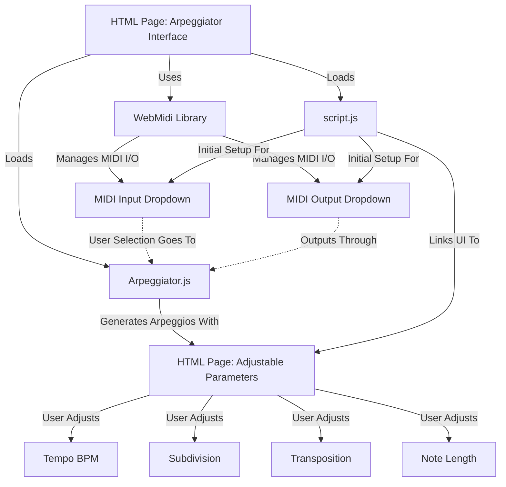

```mermaid
graph TD
    A[HTML Page: Arpeggiator Interface] -->|Uses| B[WebMidi Library]
    A -->|Loads| C[Arpeggiator.js]
    A -->|Loads| D[script.js]
    
    B -->|Manages MIDI I/O| E[MIDI Input Dropdown]
    B -->|Manages MIDI I/O| F[MIDI Output Dropdown]
    
    C -->|Generates Arpeggios With| G[HTML Page: Adjustable Parameters]
    
    D -->|Initial Setup For| E
    D -->|Initial Setup For| F
    D -->|Links UI To| G
    
    G -->|User Adjusts| H[Tempo BPM]
    G -->|User Adjusts| I[Subdivision]
    G -->|User Adjusts| J[Transposition]
    G -->|User Adjusts| K[Note Length]

    
    E -.->|User Selection Goes To| C
    F -.->|Outputs Through| C

```
